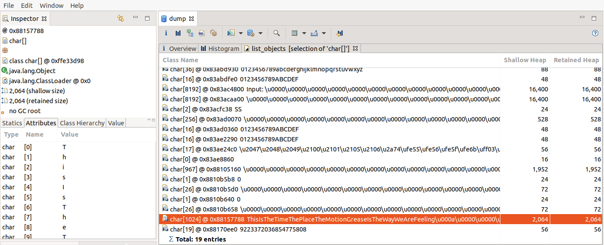
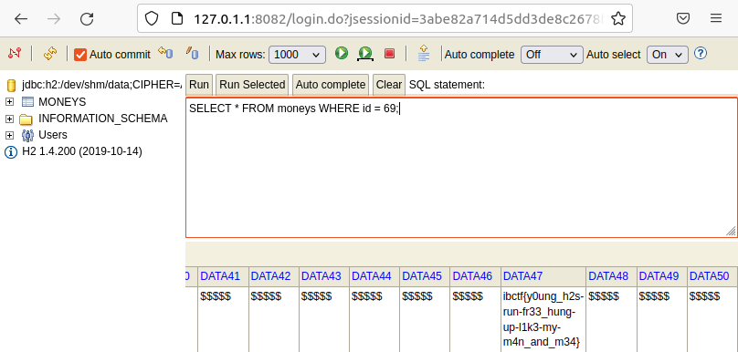

# Solution

Attached are two files: `dump` and `data`. File `data` is an encrypted H2 database (with AES, therefore not easily, if at all, breakable). File `dump` is a Java HPROF file that contains a Java heap dump of a "change AES password" tool.

Target of the challenge is to deduce what the files are and extract the AES password from the HPROF file to decrypt the H2 database which holds the flag.

## Extracting the AES password

To extract the password from HPROF, use any profiler. For this solution we will use MemoryAnalyzer. The HPROF dump might require some searching but the AES password is there:



The AES password needed to decrypt the H2 DB is `ThisIsTheTimeThePlaceTheMotionGreaseIsTheWayWeAreFeeling`.

## Decrypting the H2 database

There are different ways, either by writing own code that uses the H2 API or by using ready-made ChangeFileEncryption utility from H2 or access the database via H2 console. Note that you must rename the `data` file into `data.mv.db` in order to successfully access it with H2 tools.

This solution accesses the data via H2 console. For this you need to execute the H2 jar:
```
java -jar h2*.jar
```

Afterwards via console set the following properties to connect to the database:
```
Generic H2 (Embedded)
Driver Class: org.h2.Driver
JDBC URL: jdbc:h2:./data;CIPHER=AES
User Name: sa
Password: ThisIsTheTimeThePlaceTheMotionGreaseIsTheWayWeAreFeeling 
```

Also note that **password must hold an additional `<space>` characted (`\x20`)** in order to successfully decrypt the H2 database.

## Getting the flag

There is only one table in the database and you might need some time to get the correct flag. The following SQL query will give you the flag immediately:
```
SELECT * FROM moneys WHERE id = 69;
```



The flag is `ibctf{y0ung_h2s-run-fr33_hung-up-l1k3-my-m4n_and_m34}`.
