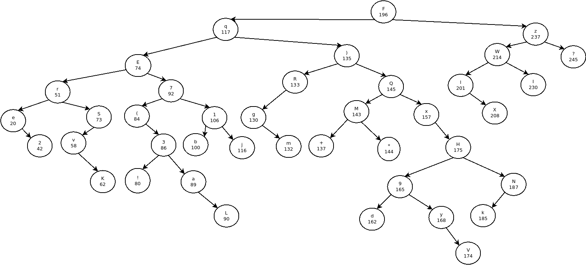

# Solution

File `verificator` constructs a binary tree filled with struct nodes containing a letter and an integer. The algorithm uses the leftmost or rightmost leaf (dependant on certain parameters) of the tree to check for sequence of characters which joined together represent a password for the encrypted data file provided with the binary.

## Constructing an initial tree - FUN\_0010161e

The struct used for a tree node is:
```c
struct node {
	uint8_t pos;
	uint8_t data;
	struct node* l;
	struct node* r;
};
```

Each node is positioned depending on the integer `pos`. The `(pos, data)` pairs are derived from two globals contained in the binary.

If using ghidra, it is observed that the `pos` is taken from the globals at `0x00102020`:
```
                             NUMBERS_CONST                                   XREF[2]:     create_tree:00101652(*), 
                                                                                          create_tree:00101659(R)  
        00102020 c4              ??         C4h
        00102021 75              ??         75h    u
        00102022 4a              ??         4Ah    J
        00102023 87              ??         87h
        00102024 5c              ??         5Ch    \
        00102025 91              ??         91h
        00102026 54              ??         54h    T
        ...                      ...        ...    ...
```

Keep in mind that this is an array of integers (`uint8_t`) therefore `c4` is interpreted as 196.

The `data` is taken from the second global located at `0x00104010` and contains a concrete string:
```
                             PTR_s_FqE)7Q(1zr?3exR!jbaS2WH9NM*vKylI_00104010 XREF[1]:     create_tree:00101638(R)  
        00104010 50 20 10        addr       s_FqE)7Q(1zr?3exR!jbaS2WH9NM*vKylI_00102050      = "FqE)7Q(1zr?3exR!jbaS2WH9NM*vK
                 00 00 00 
                 00 00
```

Therefore, the first node inserted into the tree is `(196, 'F')` pair. The tree contains 40 nodes and is constructed as follows:


## Constructing the password from the tree - FUN\_00101727

Characters are picked from the binary tree in a specific order. The implementation alternates between the leftmost and righmost node which is dependent on a constant `uint8_t` array located at `0x00102048`:
```
                             DAT_00102048                                    XREF[2]:     verify:00101779(*), 
                                                                                          verify:00101780(R)  
        00102048 04              ??         04h
        00102049 05              ??         05h
        0010204a 06              ??         06h
        0010204b 06              ??         06h
        0010204c 00              ??         00h
        0010204d 00              ??         00h
        0010204e 00              ??         00h
        0010204f 00              ??         00h
```

From memory dump, we can conclude that the constant array contains the following values: [4, 5, 6, 6]. These values mandate how many times will the leftmost or rightmost node be extracted from the tree (note that the values are checked against user input and node is removed afterwards in the same function):
```c
// function at 0x00101682
bool check_char(byte *root_node,long user_input,byte *u_input_pos,byte constant_arr_val,
               undefined *extract_node_func)

{
  byte *extracted_node;
  byte *curr_node;
  byte i;
  
  i = 0;
  curr_node = root_node;
  while( true ) {
    if (constant_arr_val <= i) {
      return true;
    }
    extracted_node = (byte *)(*(code *)extract_node_func)(curr_node);
    if ((uint)extracted_node[1] != (int)*(char *)(user_input + (ulong)*u_input_pos)) break;
    curr_node = delete_node(curr_node,*extracted_node);
    i = i + 1;
    *u_input_pos = *u_input_pos + 1;
  }
  return false;
}
```

Whether the rightmost or leftmost node is to be extracted depends on the last bit of current iterator value in the top level caller function:
```c
// excerpt from function at 0x00101727
...
    if ((i & 1) == 0) {
      extract_func = leftmost_node_func;
    }
    else {
      extract_func = rightmost_node_func;
    }
...
```

Combining values from the `uint8_t` constant array at `0x00102048` and implementation of node extraction, the values are picked as follows:
- extract the leftmost node 4 times
- extract the rightmost node 5 times
- extract the leftmost node 6 times
- extract the rightmost node 6 times

Keeping in mind that nodes are deleted after selection, we can construct the sequence from the above tree picture:
```
- leftmost:  e
- leftmost:  2
- leftmost:  r
- leftmost:  v
- rightmost: ?
- rightmost: z
- rightmost: I
- rightmost: W
- rightmost: X
- leftmost:  K
- leftmost:  S
- leftmost:  E
- leftmost:  (
- leftmost:  !
- leftmost:  3
- rightmost: l
- rightmost: F
- rightmost: N
- rightmost: k
- rightmost: H
- rightmost: V
```

Therefore, the final sequence (and our decryption key) is:
```
e2rv?zIWXKSE!(3lFNkHV
```

To get the flag use the decryption command from task description:
```sh
$ openssl enc -d -aes-256-cbc -pbkdf2 -in data -out flag.txt
enter aes-256-cbc decryption password:
$ cat flag.txt
The binary tree groans, and the file decrypts.

ibctf{b1n_tr33-is-a-w4y-0f-IT_lyfe}"
```
